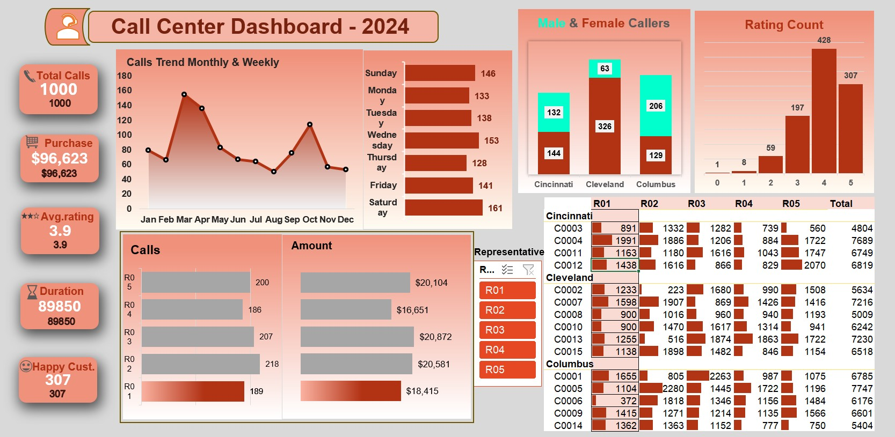

# 📞 Call Center Dashboard - 2024

## 🔹 Project Overview
This project analyzes **call center performance** for the year 2024 using an interactive dashboard.  
The dashboard tracks **key KPIs, agent performance, customer satisfaction, and call trends** to provide data-driven insights.

---

## 📊 Dashboard Preview

---

## 🔹 Key Metrics (KPIs)
- **Total Calls:** 1000  
- **Total Purchase Value:** $96,623  
- **Average Rating:** 3.9  
- **Total Call Duration:** 89,850 minutes  
- **Happy Customers (5-star ratings):** 307  

---

## 🔹 Dashboard Features
1. **Monthly & Weekly Call Trend**  
   - Call volume trend across the year.  
   - Peaks in **March** and **November**.

2. **Day-wise Call Distribution**  
   - Highest calls: **Saturday (161)** and **Wednesday (153)**.  
   - Lowest calls: **Thursday (128)**.  

3. **Male vs Female Callers**  
   - Gender-wise breakdown across **Cincinnati, Cleveland, and Columbus**.  
   - Cleveland has the most male callers.  

4. **Customer Ratings**  
   - Most ratings are **4★ (428)** and **5★ (307)**.  
   - Very few low ratings (1★ and 2★).  

5. **Representative Performance (R01–R05)**  
   - **R03** handled the most calls (218) and generated $20,581.  
   - Balanced view of workload and revenue per agent.  

6. **City & Agent Drilldown**  
   - Detailed performance of agents by **customer IDs**.  
   - Helps identify **high-value customers** and **team efficiency**.  

---

## 🔹 Insights
- Customer satisfaction is **average (3.9)** → improvement opportunity.  
- Peak call volumes on **mid-week & weekends** → staffing adjustments required.  
- **Top-performing agents (R03 & R04)** drive both call handling and revenue.  
- **Cleveland** shows the highest call activity.  

---

## 🔹 Tools Used

- **Excel / CSV** – Data preprocessing & Dashboard Creation  
